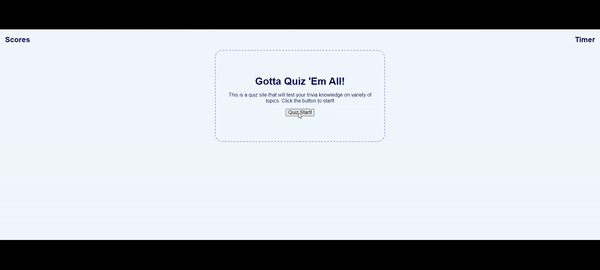

# Gotta Quiz 'Em All
Gotta Quiz 'Em All is a site designed to provide quizzes around fun trivia on topics such as coding and gaming. It will time the player through through the quiz and provide them a score based on how fast they were able to complete it. The questions are randomized for each playthrough to increase replayability. Upon score submission, the player is tajen to the High Score page. Here they can either reflect on their past score(s) or use as motivation to score better next time. They can also clear all scores, if desired. 

This project was a chance to create a fun little application that helped me to become more comfortable with Javascript. Setting intervals as well as storing data into local storage were just some of the techniques I used to create this project. 

## Usage

Below is a demo of Gotta Quiz 'Em All:

## Credits

Shout to Eric for helping me to brainstorm the ideas for this project:

[Eric Kim](https://github.com/EricKim86)

Shout to Avani for helping me work through the High Score page:

[Avani Muchhala](https://github.com/AvaniMuchhala)

Below is the person who helped me to construct the High Score page and their blog:

[Michael Karén](https://michael-karen.medium.com/how-to-save-high-scores-in-local-storage-7860baca9d68)

Below are the links to were I got 

[Pixalbay: Correct Choice](https://pixabay.com/sound-effects/?utm_source=link-attribution&amp;utm_medium=referral&amp;utm_campaign=music&amp;utm_content=43861)
[Pixalbay: Wrong Buzzer](https://pixabay.com/?utm_source=link-attribution&amp;utm_medium=referral&amp;utm_campaign=music&amp;utm_content=6268)

## License

[MIT License](https://github.com/JPauldo/gotta-quiz-em-all/blob/main/LICENSE).
